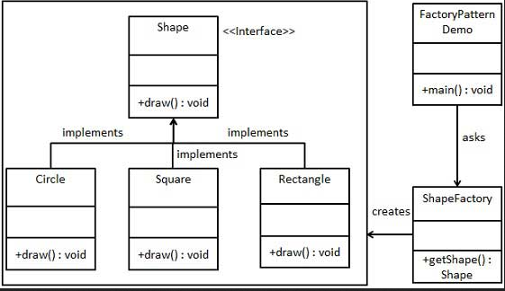
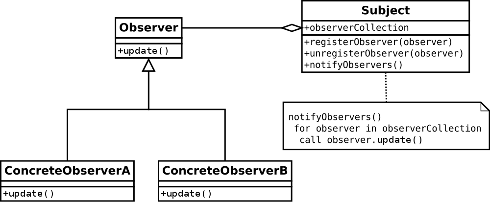
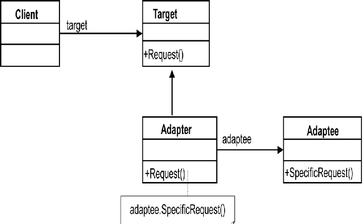

# 31-01-2024 - 01-02-2024 Gün özeti

## Desing Patterns

**Design Pattern'ler** üzerine çalışmalar yaptım. Üç ana başlığın **Creational**, **Structural**, **Behavioral** Pattern olmak üzere üç ana başlıktaki ve altındaki design patternleri araştırdım.
Yaptığım araştırmalar sonucunda bütün design patternlere kısa kısa baktıktan sonra internet üzerinden yazılımcı forumlarına ve diğer eğitici bloglara baktığımda altı tane design pattern üzerine daha fazla araştırma yaptım.

- **Singleton** Design Pattern
- **Factory** Design Pattern
- **Strategy** Design Pattern
- **Observer** Design Pattern
- **Builder** Design Pattern
- **Adapter** Design Pattern
- **State** Design Pattern

### Singleton Design Pattern

Yapılan işlemler için bir nesnenin **bir kez** oluşturulmasından ardından program durdurana kadar bu nesne üzerinden işlemler gerçekleşir. İlgili sınıftan nesne ilk kez işlem yapılıyorsa yeni bir nesne döndürecek ve bundan sonraki süreçte bütün işlemleri bu nesne üzerinden yapacaktır.

### Factory Design Pattern

**Birbirleriyle ilişkili** ya da **benzerlik** gösteren class'ların bir araya toplayıp kolaylıkla tek bir yerden tüm yerde kullanılan class'ı değiştirebilmek için yönetimi kolayca sağlayabilme amacıyla factory design pattern kullanılır.

### Observer Design Pattern

Bir sunucuda gerçekleşen herhangi bir olayın gerçekleştiği anda istemcilerine bildirmesi olarak tanımlanabilmektedir. İstemcilerin devamlı sunucuya gidip olayın gerçekleşip gerçekleşmediğini öğrenmesi yerine sunucunun **olay gerçekleşince** istemcilere haber vermesidir.

### Builder Design Pattern

Bütünü oluşturan parçaları adım adım oluşturarak karmaşık bütünü oluşturan design pattern'dir.
Nesnenin farklı özellikleri ayrı ayrı belirlenir ve ardından yönetici class tarafından kullanılır.
Parçlaradan istenilen özellikler eklenebilir ve çıkarılabilir haldedir.

### Adapter Design Pattern

İki uyumsuz interface'i birlikte kullanılmasını sağlar. Daha önceden yazılan interface'lerin hali hazırdaki kodlarını değiştirmeden interface ve sınıf arasında bir adapter ilişkisi sağlamak için kullanılır.

### State Design Pattern

Nesnenin iç durumu değiştiğinde davranışının da değiştirilmesini sağlar. Nesneyi farklı durumlara karşı hazırlıklı hale getirir.

###

Araştırmalarım sonucunda bu notları elde ettim ve Github ve Medium üzerinden projeler ve rehberleri incledim. Patternler hakkında genel bilgiyi öğrendiğim için geliştirdiğim proje üzerinden bu design patternleri kullanarak pekiştirmeyi amaçlıyorum.

Design Patternleri araştırdıktan sonra Repository ve Dependcy Injection ile de alakalı araştırmalar yaptım. **Repository - Service - Controller - Model** arasındaki ilişkileri Laravel forumlarında ve Stackoverflow üzerinden araştırdım. https://stackoverflow.com/questions/18817615/managing-relationships-in-laravel-adhering-to-the-repository-pattern bu Stackoverflow sayfasını ve cevaplarını okuyup araştırdığım zaman kafamda gerçek anlamda bir şeyler oturmaya başladı.
Dependcy Injection'ı bu ilişkilerde nerede ve neden kullanılması gerektiğini de araştırdım. Şu an geliştirmekte olduğum projeyi yarından itibaren bu ilişkilere uygun olacak şekilde güncelleyeceğim. Güncelledikten sonra proje içerisinden örnekler göstererek bu ilişkilerin ne işe yaradığını ve nasıl yapıldığını rapor olarak yazacağım. 31-01-2024'de Design patternler ile alakalı çalışmalarda bulundum fakat araştırdıkça konular biriktiği için 01-02-2024 tarihine ertelendi raporum. 01-02-2024 tarihinde de neredeyse bütün gün sadece Repository - Service - Controller - Model ilişkisi ve Dependcy Injection örneklerini rehberlerini okuyarak geçirdim.

### 02-01-2024 Tarihinde yapacaklarım

- Geliştirdiğim projeyi **Repository pattern'e** uygun hale getireceğim.
- Yapılan değişikleri açıklayıp kendim için bir kaynak oluşturacağım.
