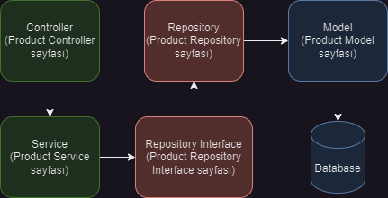

# Özet

Ürünler için Repository - Service yapısı örneği.

Kendi geliştirdiğim projeden örnek bir yapı:
https://github.com/SiHecate/laravel-ecommerce



## Repositories interface Sayfası

```
    <?php

    namespace App\Services\Repositories\Interfaces;

    interface ProductRepositoryInterface
    {
        public function getAll();

        public function findProductById($id);

        public function createProduct(array $data);

        public function update(array $data, $id);

        public function deleteProduct($id);
    }
```

## Repository Sayfası

```
    <?php

    namespace App\Services\Repositories;

    use App\Models\Product;
    use App\Services\Repositories\Interfaces\ProductRepositoryInterface;

    class ProductRepository implements ProductRepositoryInterface
    {
        public function getAll()
        {
            return Product::orderBy('created_at', 'asc')->get();
        }

        public function findProductById($id)
        {
            return Product::find($id);
        }

        public function createProduct(array $data)
        {
            return Product::create($data);
        }

        public function update(array $data, $id)
        {
            $product = Product::find($id);

            if ($product) {
                $product->update($data);
                return $product;
            }
            return null;
        }

        public function deleteProduct($id)
        {
            $product = Product::find($id);

            if ($product) {
                $product->delete();
                return true;
            }
            return false;
        }
    }
```

## Requests Sayfası

```
    <?php

    namespace App\Http\Requests;

    use Illuminate\Foundation\Http\FormRequest;

    class ProductRequest extends FormRequest
    {
        public function rules(): array
        {
            return [
                'title' => ['required', 'string', 'max:40'],
                'description' => 'nullable|string',
                'image' => 'required|image|mimes:jpeg,png,jpg,gif,svg|max:2048',
                'price' => ['required', 'numeric', 'between:0.01,999999.99'],
                'stock' => ['required', 'numeric'],
                'visibility' => 'nullable',
                'tag' => ['required', 'string', 'max:40'],
            ];
        }
    }
```

## Service Sayfası

```
    <?php

    namespace App\Services;
    use App\Models\Product;
    use Illuminate\Http\JsonResponse;
    use App\Services\Repositories\Interfaces\ProductRepositoryInterface;

    class ProductService
    {
        /*
            Product objects:
                $table->id();
                $table->string('title', 40);
                $table->string('description')->nullable();
                $table->string('image')->nullable();
                $table->decimal('price', 10, 2);
                $table->decimal('stock');
                $table->boolean('visibility');
                $table->string('tag', 40);
                $table->timestamps();

        */
        protected $productRepository;

        public function __construct(ProductRepositoryInterface $productRepository)
        {
            $this->productRepository = $productRepository;

        }

        public function getProduct(): JsonResponse
        {
            $products = $this->productRepository->getAll();

            if ($products->isNotEmpty()) {
                $allProducts = $products->map(function ($product) {
                    return [
                        'product_id' => $product->id,
                        'product_title' => $product->title,
                        'product_desc' => $product->description,
                        'product_image' => $product->image,
                        'product_price' => $product->price,
                        'product_stock' => $product->stock,
                        'product_creating_time' => $product->created_at,
                    ];
                });

                return response()->json([
                    'message' => 'All products in database',
                    'data' => $allProducts,
                ]);
            }
            return response()->json([
                'message' => 'Products not found in database',
                'data' => [],
            ]);
        }

        public function viewProduct($productId): JsonResponse
        {
            $product = $this->productRepository->findProductById($productId);

            if ($product) {
                return response()->json([
                    'message' => "Product $productId",
                    'data' => $product,
                ]);
            } else {
                return response()->json([
                    'message' => "Product not found $productId",
                ]);
            }
        }

        public function findProduct($productId)
        {
            return $this->productRepository->findProductById($productId);
        }

        public function createProduct(array $data): JsonResponse
        {
            try {
                $visibility = $data['stock'] > 0 ? 1 : 0;
                $data = array_merge($data, ['visibility' => $visibility]);

                $product = $this->productRepository->createProduct($data);


                return response()->json([
                    'message' => 'Product created successfully',
                    'data' => $product,
                ], 200);
            } catch (\Exception $e) {
                return response()->json([
                    'message' => 'Product creation failed',
                    'error' => $e->getMessage(),
                ], 500);
            }
        }

        public function update(array $data, $productId)
        {
            $this->productRepository->update($data, $productId);
            return response()->json(['message' => 'Product updated successfully', 'product' => $data], 200);
        }

        public function deleteProduct($productId): JsonResponse
        {
            $productInfo = $this->findProduct($productId);
            $this->productRepository->deleteProduct($productId);

            return response()->json([
                'message' => 'Product removed successfully',
                'data' => $productInfo,
            ]);
        }

    }
```

## Controllers Sayfası

```
    <?php

    namespace App\Http\Controllers;

    use App\Models\Product;
    use App\Http\Requests\ProductRequest;
    use App\Services\ProductService;
    use App\Services\Repositories\ProductRepository;

    class ProductController extends Controller
    {

        protected $productRepository;
        protected $productService;


        public function __construct(ProductRepository $productRepository, ProductService $productService)
        {
            $this->productRepository = $productRepository;
            $this->productService = $productService;
        }

        public function index()
        {
            $allProducts = $this->productService->getProduct();
            return $allProducts;
        }

        public function store(ProductRequest $request, ProductService $productService)
        {
            $validatedData = $request->validated();
            $response = $productService->createProduct($validatedData);
            return $response;
        }


        public function show($id)
        {
            $product = $this->productService->findProduct($id);
            return $product;
        }


        public function update(ProductRequest $request, $id)
        {
            $validatedData = $request->validated();
            $response =  $this->productService->update($validatedData, $id);
            return $response;
        }

        public function destroy($id)
        {
            $product = $this->productService->deleteProduct($id);
            return $product;
        }
    }
```
