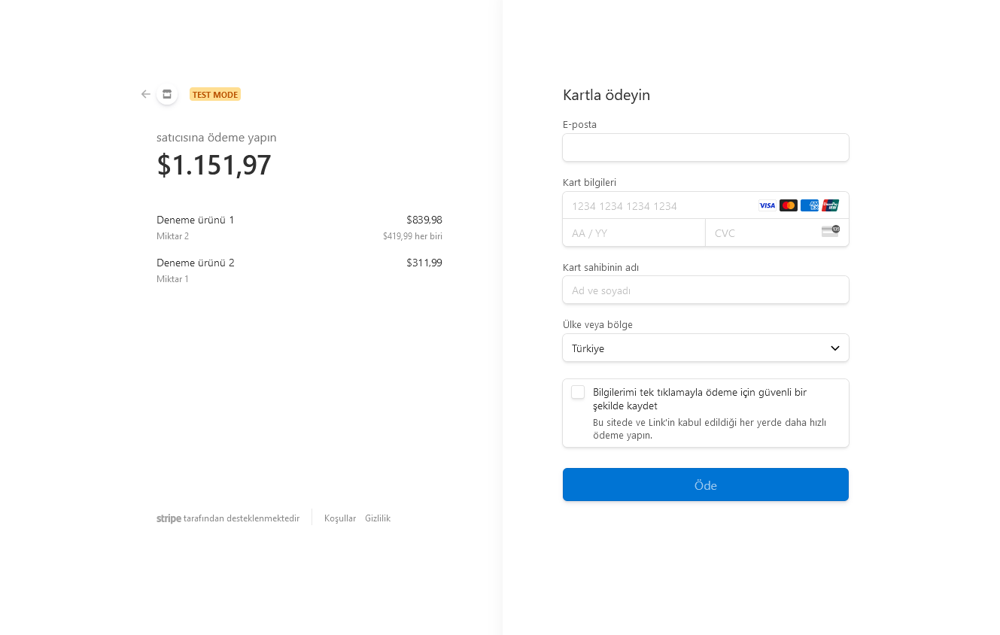
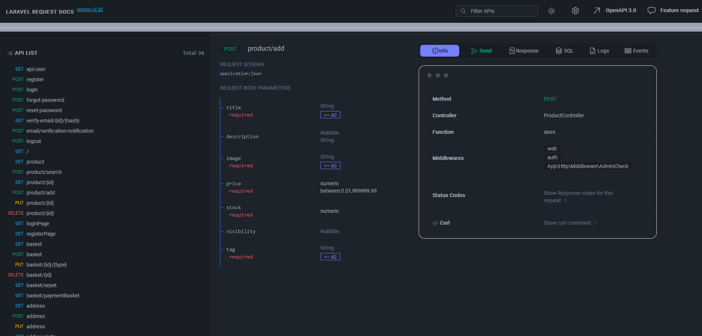

# Özet

Alışveriş sistemi entegrasyonu yapıldı
Api documentation eklendi

## Ödeme sistemi

Ödeme sisteminde stripe'ı kullanma kararı aldım. Online ödeme sistemlerinde istenilen parametreler genel anlamıyla aynı olduğu için stripe katmanı ayrı kullanıcının bilgilerinin alındığı katmanı ayrı olarak tasarladım, bu sayede farklı bir ödeme sistemi eklenmesi gerektiğinde sadece ödeme sisteminin katmanı üzerinde değişiklikler ya da yeni ödeme sistemi eklemesi yapılabilir.

### Stripe Service



```
    public function checkout($userId) {
        \Stripe\Stripe::setApiKey(env('STRIPE_SECRET_KEY'));
        $response = $this->basketService->paymentServiceBasket($userId);
        $products = $response->getData();
        $lineItems = [];
        $totalPrice = 0;

        foreach($products->product_datas as $product) {
            $lineItems[] = [
                 'price_data' => [
                     'currency' => 'usd',
                     'product_data' => [
                         'name' => $product->title,
                     ],
                     'unit_amount' => $product->price * 100,
                 ],
                 'quantity' => $product->quantity,
            ];
            $totalPrice += $product->price * $product->quantity;
        }
        $session = \Stripe\Checkout\Session::create([
            'line_items' => $lineItems,
            'mode' => 'payment',
            'success_url' => route('checkout.success', [], true) . "?session_id={CHECKOUT_SESSION_ID}",
            'cancel_url' => route('checkout.cancel', [], true),
        ]);

        $order = new Order();
        $order->status = 'unpaid';
        $order->total_price = $totalPrice;
        $order->session_id = $session->id;
        $order->save();

        return redirect($session->url);
    }

```

```
    public function success($request)
    {
        \Stripe\Stripe::setApiKey(env('STRIPE_SECRET_KEY'));
        $sessionId = $request->get('session_id');
            $session = \Stripe\Checkout\Session::retrieve($sessionId);
            dd($session);
            if (!$session) {
                throw new NotFoundHttpException;
            }
            $customer = \Stripe\Customer::retrieve($session->customer);

            $order = Order::where('session_id', $session->id)->first();
            if (!$order) {
                throw new NotFoundHttpException();
            }
            if ($order->status === 'unpaid') {
                $order->status = 'paid';
                $order->save();
            }

            return $customer;
    }
```

### Basket Service

```
    public function paymentServiceBasket($userId)
    {
        $basket = $this->basketRepository->findUserBasket($userId);
        $products = json_decode($basket->products, true) ?? [];
        $totalPrice = $this->calculateTotalPrice($products);
        $productDetails = [];
        $productQuantity = [];
        foreach ($products as $product_id) {
            $product = $this->productService->findProductById($product_id);
            $productQuantity[$product_id] = isset($productQuantity[$product_id]) ? $productQuantity[$product_id] + 1 : 1;
            if ($product) {
                $productDetails[$product->id] = [
                    'title' => $product->title,
                    'image' => $product->image,
                    'price' => $product->price,
                    'quantity' => $productQuantity[$product_id],
                ];
            }
        }
        return response()->json([
            'product_datas' => $productDetails,
            'basket_total_price' => $totalPrice,
        ], 200);
    }

```

### UserInfo service

```
    public function getUserInfos($userId): JsonResponse
    {
        $userInfos = $this->userInfoRepository->getUserInfos($userId);
        if ($userInfos->isNotEmpty()) {
            $formattedUserInfos = $userInfos->map(function ($info) {
                return [
                    'address_name' => $info->address_name,
                    'name' => $info->name,
                    'surname' => $info->surname,
                    'email' => $info->email,
                    'telephone' => $info->telephone,
                    'city' => $info->city,
                    'district' => $info->district,
                    'neighborhood' => $info->neighborhood,
                    'address' => $info->address
                ];
            });
            return response()->json([
                'message' => 'user_infos',
                'data' => $formattedUserInfos,
            ]);
        }
        return response()->json([
            'message' => 'user_info not found',
            'data' => [],
        ]);
    }
```

## Api Documentation

Frontend tarafındaki geliştiriclerin işini kolaylaştırmak amaçlı önceden golang'te kullandığım breeze'in daha iyi bir alternatifini buldum ve uygulamaya entegre ettim. Uygulama içerisindeki bütün route'ları ve bu route'ların ne çeşit parametreler istediğini gösteriyor.



http://127.0.0.1:8000/request-docs

Adresinde uygulma üzerindeki bütün route'lara ve bu route'ları test edebilmeye yarayan sayfaya erişebiliyoruz.
