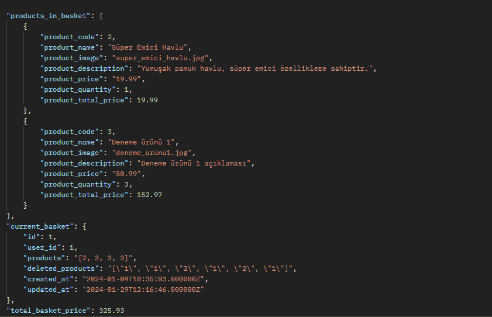

# İlk gün

## Gün özeti

Genel anlamıyla araştırma ve başka yapılan projeleri incelememle geçen bir gün oldu uygulama içerisinde ufak değişiklikler yaptım.

## Uygulama notları

Basket işlemleri yapıldığı zaman toplam sepet tutarını almam gerekiyordu bunun için BasketController içerisinden bu kodları hazırladım

Buradan aldığım toplam sepet tutarını ve tekli sepet tutarlarını online ödeme sayfasında kullanacağım

Uygulamayı iki farklı şekilde tasarlayabilme şansım vardı;

- Site içerisine bakiye yükleyip bunun üzerinden harcama yaptırılabilirdi
  bknz: https://www.bynogame.com/tr

- Site içerisinden bakiye yerine direkt olarak sepet tutarı kadar online ödeme yaptırılabilirdi
  bknz: https://www.trendyol.com/

Şu an için ikinci olan seçeneği seçiyorum ikinci olan seçeneği tam anlamıyla projeye entegre ettikten sonra ilk seçenekteki ödeme şeklini siteye entegre etmeyi planlıyorum.

## Uygulamada çözülmesi ve araştırılması gerekenler

- Online ödeme sistemine göre bir sistem tasarlamadığım için baştan beri online ödemi sistemi için gereken verileri toplamam gerekiyor.

- Online ödeme sistemini projeye entegre ettikten sonra tam olarak nasıl "payment" sayfasını hazırlayabilirim araştırma yapılması gerekiyor. Bunun için daha önceden yapılan github projelerine göz gezdirdim laravel tarafında yapılan

  - https://github.com/aimeos/aimeos-laravel
  - https://github.com/avored/laravel-ecommerce
  - https://github.com/jsdecena/laracom (Güzel bir kaynak detaylı bir şekilde inceleyeceğim)

- Transaction'la alakalı daha önceki geliştirdiğim projelerde temel özellikler geliştirmiştim fakat hem laravel tarafında hem de bu tarz bir projede geliştirmediğim için araştırma yapmam gerekiyor.

### Ödeme sistemi detayları

Online ödeme sistemleri ile alakalı araştırmalar yaptım bu araştırmalar sonucunda

- Stripe
- PayPal
- CoinBase
- PayTR
- WeePay
- Paymax
- Shipy
- Paywant
- Shopier
- Mercado Pago
- Paymentwall
- Mollie
- Iyzico

seçeneklerini buldum hem entegrasyon desteğiyle alakalı güzel bir repo'su bulunmasından dolayı hem de geliştirici forumlarında birden fazla bu ödeme yöntemiyle alakalı rehber bulduğum için tercihimi iyzico'dan yana kullandım

Ödeme sistemini projeye dahil ederken bu kaynaktan yardım almaya devam edeceğim.

https://github.com/iyzico/iyzipay-php
