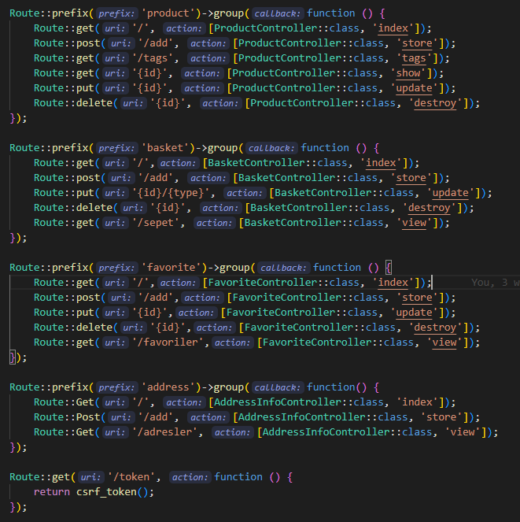
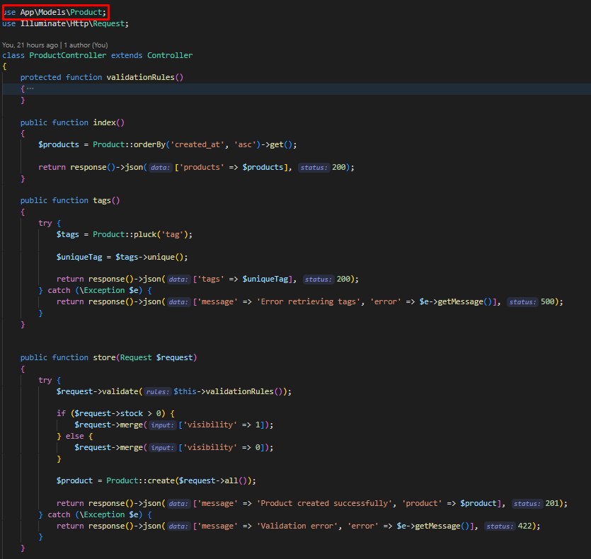
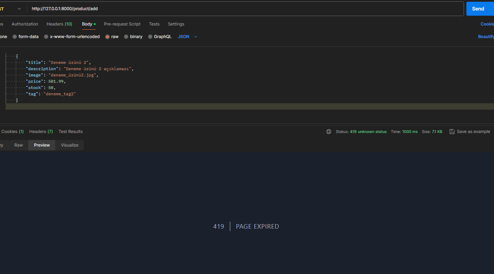
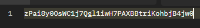
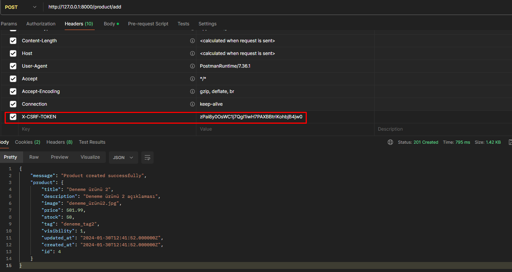

# MVC mimarisi nedir ? Backend dillerinde kullanımları nasıldır ? Örnekleri nelerdir ?

## MVC (Model-View-Controller)

MVC design pattern'i üç katmadan oluşur. Bu katmanlar birbirinden bağımsız olarak çalışmaktadır.
Bu özelliğinden ötürü herhangi bir katmanda değişikliğe gidilmesi ya da bir problem yaşanması durumunda diğer katmanlar
olabildiğince az etkilenir aynı zamanda katmanlar arası kontrolün daha rahat olmasını sağladığı gibi farklı katmanlar üzerinden
farklı geliştirmelerde eş zamanlı olarak yapılabilir.

#### Model katmanı nedir?

**Model**, bir projede veri işleme katmanı ve iş mantığı sağlayan bir araç ve bölümdür. Proje içinde verileri etkili bir şekilde yönetmek ve işlemek için kullanılır.
Modeller, projede kullanılacak verileri işlemek, düzenlemek, görüntülemek ve silmek için kullanılabilir;
bu aynı zamanda sorgu işlemlerini gerçekleştirmek anlamına gelir.

#### View katmanı nedir?

**View**, MVC'de projenin arayüzlerinin ve görüntülerinin oluşturulduğu bölümdür.
Bu katmanda projenin kullanıcıya sunulacak olan görsel olarak sunulan sayfaların içerğini içerir.
View'de genellikle HTML, CSS, JS gibi teknolojileri içerir.

#### Controller katmanı nedir?

**Controller**, MVC'de projenin kontrol ve karar mekanizmasıdır. View model arasında köprü görevi görür ve projenin ana işlemleri bu katmanda yapılır.
Veriler Model katmanından alınarak controller içerisinde işlenerek View katmanına aktarılır.

### Model-View-Controller life cycle

1. **HTTP request**
2. **Routing**
3. **Controller**
4. **ViewResult**
5. **ViewEngine**
6. **View**
7. **Response**

# Request Lifecycle nedir ? Aşamaları nelerdir ? Backend dillerinde nasıl kullanılır ?

Request life cycle bir web uygulamasının isteğin başlangıcından sonuna kadar olan süreçtir.
Bu süreç temel olarak isteğin alınıp işlenip kullanıcıya geri gönderilmesi üzerinedir.

Yaşam döngüsü MVC pattern'deki life cycle'a benzemektedir.

1. **İstek Alma (Request Handling)**
   İstemci tarafından gönderilen HTTP isteği sunucu tarafından alınır. Bu istek bir kaynağa yönlendirilir.

2. **Yönlendirme (Routing)**
   İstemciden alınan isteği istenilen kontrolcüye yölendirilmelidir. İsteğin URL'sine ve HTTP metoduna dayanarak (GET, POST, PUT, DELETE)
   uygun kontrolcüyü belirlemeyi içerir.

Örnek bir laravel routing'i

3. **Kontrolcü İşlemi (Controller action)**
   Routing aracılığı ile belirtilen kontrolcü isteği işlemek için bir 'action' gerçekleştirir. Bu aşamada MVC'deki model aracılığı ya da Model kullanılmadan işlemleri, hesaplamaları ya da buna benzer 'action'ları gerçekleştirir.

4. **Model İşleme (Model Processing)**
   İşlemler sırasında veri işleme ya da manipülasyonu gerekirse bu aşamada gerekli veriler elde edilir, işlenir ve işlenen veriler tekrardan model'e gönderilir. Bu sayede veri işlenmiş olur.

Model işleme ve Kontrolcü işleminin laravel örneği

5. **View Oluşturma (View Creation)**
   Model ve Controller aşamasında işlenen veriler bir görünüm (view) saysinde kullanıcıya sunulabilir. Bu adım genellikle HTML, JSON, XML ya da buna benzer şablon motoru kullanılarak gerçekleştirilir.

6. **Yanıt (Response)**
   Oluşturulan görünüm ya da istenilen veri istemciye gönderilir.

7. **Bitiş (Termination)**
   İstek yaşam döngüsü tamamlanır ve hizmete gönderilir.

# CSRF nedir ? Korunma yolları nelerdir ?

**CSRF (Cross Site Request Forgery)** yani Türkçe karşılığı ile Siteler Arası İstek Sahtekarlığı,  
herhangi bir web uygulamasında oturum açmış bir kullanıcının oturumunu kullanarak kullanıcının istekleri dışında işlemler yapılmasıdır. Bu saldırı yöntemi, hedeflenen son kullanıcının isteği üzerine işlemlerin gerçekleştirilmesine izin verir.
Uygulamaya giden isteklerin hangi kaynaktan ve nasıl gönderildiğinin kontrol edilmeyen sistemlerde bu zafiyet meydana gelir.

#### **Önlemler**

Kullanıcıların gerçekleştirdiği talepler POST metodu ile alınmalıdır.
Kullanıcıya özel olarak üretilmiş tokenler ile CSRF in önüne geçilmiş olur. Bu token her işlemde tekrar üretilir ve formda saklanır böylelikle saldırganın bu tokeni tahmin etmesi imkansız hale gelir. Bu kısımda önemli olan şey ise token üretirken doğru bir patern ve güvenilir kriptografi yöntemleri kullanılmasıdır. Birden fazla token yöntemi oluşturma yöntemi vardır.
Bu yöntemlerden birisi de Laravel Framework'ünün özelliklerinden birisi olan @csrf tag'idir. giriş talep eden tokenin oturumda saklanan token ile eşleşip eşleşmediğini otomatik olarak doğrulayacak ve dolayısıyla token doğrulamasından sonra erişime izin verir.

# Library(Kütüphane) ile Framework(Uygulama Çerçevesi) nedir ? Aralarındaki farklar ve benzerlikler nelerdir ?

Library'ler ve Framework'ler, yazılım geliştirmede kullanılan iki farklı yapıdır. Ancak, farklı yapılarına rağmen birçok benzer özellik paylaşırlar. Library'ler, genellikle belirli bir işlevselliği içeren bir dizi fonksiyon ve modül sunan bağımsız yapılar iken, Framework'ler, önceden farklı geliştiriciler tarafından hazırlanmış kütüphaneleri içeren ve bu kütüphaneleri birleştirerek bir çerçeve oluşturan yapıdır. Yani aslında, Framework'ler, kütüphanelerin birleşimiyle ortaya çıkar.

#### Farklar:

- Library'ler, geliştiriciye daha fazla kontrol hakkı tanır; istenilen özellikler eklenebilir ve çıkarılabilir çünkü daha esnek bir yapıya sahiptir.
- Framework'lerde ise daha katı ve değiştirilmesi zor bir yapı üzerine inşa edildiği için geliştiricinin belirli kurallara uyması beklenir.
- Yapı olarak, Library'ler daha küçük ve bağımsızken Framework'ler daha büyük ve kapsamlıdır.

#### Benzerlikler:

- Her ikisi de programlama hızını ve verimini artırarak projelerin geliştirme sürecini kolaylaştırır.
- Yinelenen kod yazımını önler; önceden geliştirilmiş kod segmentleri sayesinde işlevselliği artırır.
- Kod testlerini yapmak ve hataları gidermek daha kolay hale gelir.
- Forumlar ve yazılımcı toplulukları sayesinde bir uygulama geliştirirken yaşanan sorunları veya öğrenme aşamasını kolaylaştırır.

# Design Pattern nedir ?

**Design pattern'ler**, yazılım geliştirmede sıkça karşılaşılan zorluklara yönelik yeniden kullanılabilir çözüm şablonları veya yaklaşımlardır. Bu kalıplar, belirli bir bağlamda tekrarlanan problemlere uygun çözümleri sağlamak üzere geliştirilmiş, test edilmiş etkili ve verimli tasarımlardır.

Design pattern'ler, projeleri ve kodları daha basit, anlamlı ve az karmaşık hale getirerek, ilerleyen süreçlerde ortaya çıkabilecek problemlere ve geliştirmelere hazır hale getirir. Ayrıca, dilden bağımsızdır, bu da farklı senaryolar ve diller için özelleştirilebilir ve uyarlanabilir oldukları anlamına gelir.

#### Design Pattern Kategorileri:

- Creational Patterns (Yaratımsal Kalıplar): Nesnelerin oluşturulması ve yönetilmesiyle ilgilenen desenlerdir. Program akışında hangi nesneye ihtiyaç duyuluyorsa, esneklik ve kolaylık sağlayarak bu nesnenin oluşturulmasını destekler.

- Structural Patterns (Yapısal Kalıplar): Birden fazla sınıfın birlikte çalışması ve nasıl etkileşimde bulunacaklarının belirlenmesiyle ilgilenen desenlerdir.

- Behavioral Patterns (Davranışsal Kalıplar): Nesnelerin birbirleriyle olan ilişkilerini düzenleyen desenlerdir.

Bu tasarım kalıpları, yazılım geliştirme sürecinde daha organize, sürdürülebilir ve genellikle daha hızlı bir geliştirme sağlamak için güçlü araçlar olarak kullanılırlar.

https://github.com/cnrdmrci/Design-Patterns-With-Examples

# Eloquent nedir ?

**ORM**, nesneler ile ilişkisel veritabanları arasında bir köprü kurarak, ilişkileri ve nesneleri yönetmeyi kolaylaştıran bir teknolojidir. Bu, ilişkisel veritabanları ile uygulama arasında bir bağlantı sağlar. ORM kullanımı, SQL sorgularını minimum'a indirir ve potansiyel sorunları önleyerek veritabanı işlemlerini daha etkili hale getirir. Veritabanındaki tablolar, veriler ve benzeri işlemler kod içinde daha düzenli ve yönetilebilir hale gelir.

**Eloquent**, Laravel framework'ünün içinde bulunan ve ORM işlevselliği sağlayan önemli bir özelliktir. Bu, veritabanı tablolarını PHP nesneleriyle eşleştirmek için kullanılır. Eloquent, model tabanlı ilişkiler, CRUD işlemleri, sorgu builder gibi temel özelliklere sahiptir.

Eloquent ORM, Laravel'in genel temiz, anlaşılır ve etkili kod yazmayı destekleyen önemli bir bileşenidir. Bu sayede geliştiricilere, veritabanı işlemlerini daha etkili bir şekilde yönetme ve uygulamalarını daha organize etme imkanı tanır.

# Accessor ve Mutator nedir ? Nasıl kullanılır ?

#### Getter Setter

Getter, bir sınıf özelliğinin değerini döndüren bir metodudur, setter ise bir sınıf özelliğine değer atayan bir metodudur.

#### Eloquent Accessor ve Mutator

- Accessor: Eloquent modellerinde belilri bir sütunu alırken veya sütunu gösterirken değerini değiştirmek için kullanılan bir özelliktir. Bu veritabanındaki ham veriyi düzenlemek veya dönüştürmek için kullanılır.

- Mutator Eloquent modellerinde belirli bir sütuna değer atanırken değeri değiştirmek ve işlemek için kullanılır. Bu, kullanıcıdan alınan veriyi düzenlemek veya dönüştürmek için kullanılır.

#### Kullandığım kaynaklar

https://dev.to/dalelantowork/laravel-8-accessors-and-mutators-4d8m

https://www.freecodecamp.org/news/what-is-an-orm-the-meaning-of-object-relational-mapping-database-tools/

https://github.com/cnrdmrci/Design-Patterns-With-Examples

https://www.argenova.com.tr/design-pattern-tasarim-kaliplari-nedir

https://www.gaissecurity.com/blog/cross-site-request-forgery-csrf-zafiyeti

https://feyyazacet.medium.com/asp-net-core-request-life-cycle-customize-pipeline-6d521b13bb81

https://requestly.io/blog/life-cycle-of-a-http-request/

#### _Cümleleri düzenlerken ve konular hakkında bilgileri detaylandırmam için AI'dan yardım aldım_

https://chat.openai.com/

https://bard.google.com/chat
